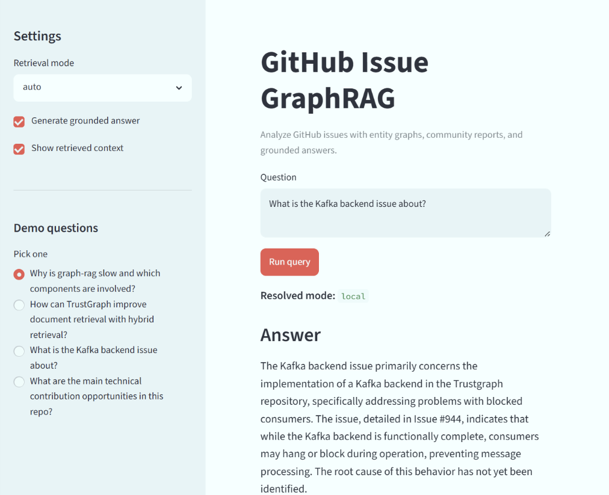

# GitHub Issue GraphRAG

A lightweight GraphRAG prototype for analyzing GitHub issues, extracting technical entities and relationships, building a repository knowledge graph, and answering contribution-oriented questions with grounded context.

The project uses TrustGraph issues as the demo dataset, but the pipeline is designed to work with any GitHub repository issue set.

## What this project does

This project turns GitHub issues into a small repository knowledge graph:

```text
GitHub issues
  ↓
TextUnit chunking
  ↓
LLM entity / relationship extraction
  ↓
Entity normalization
  ↓
Graph construction
  ↓
Graph-level normalization
  ↓
Community detection
  ↓
Community report generation
  ↓
Local / global / BM25 retrieval
  ↓
Grounded answer generation
```

The goal is not to build a perfect industrial knowledge graph. The goal is to demonstrate a practical GraphRAG pipeline with debugging tools, normalization, and explainable retrieval.

## Why GraphRAG instead of plain RAG?

Plain RAG usually retrieves chunks directly from text.

GraphRAG adds an intermediate structure:

- entities: files, modules, APIs, features, algorithms, issues, tools
- relationships: uses, depends_on, improves, conflicts_with, implements, proposes
- communities: clusters of related technical topics
- reports: summaries of each technical area

This makes it easier to answer questions like:

- What are the main contribution opportunities in this repo?
- Why is graph-rag slow and which components are involved?
- How can document retrieval be improved with hybrid retrieval?
- What is the Kafka backend issue about?

## Demo UI

The Streamlit demo provides a small interface for selecting retrieval mode, running demo questions, generating grounded answers, and inspecting retrieved context.



## Current features

- GitHub issue ingestion
- Text chunking into TextUnits
- OpenAI-compatible LLM client, tested with OpenRouter
- Robust JSON parsing for fenced LLM output
- Retry logic for unstable LLM API calls
- Entity and relationship extraction
- Entity normalization, such as:
  - `RRF` / `Reciprocal Rank Fusion`
  - `Graph-RAG` / `graph_rag` / `Graph RAG`
  - `TrustGraph` / `TG`
- Graph-level normalization after graph construction
- Community detection
- Refined community reports focused on:
  - technical theme
  - key entities
  - contribution opportunities
  - evidence and uncertainty
- Graph inspection script
- Relation inspection script
- Local GraphRAG retrieval
- Global community-report retrieval
- BM25 lexical baseline
- Grounded answer generation with `--answer`
- Streamlit demo app

## Setup

Create and activate a virtual environment:

```bash
python -m venv .venv
source .venv/Scripts/activate
```

Install dependencies:

```bash
python -m pip install -e . --no-deps
python -m pip install requests networkx pydantic python-dotenv rank-bm25 tqdm streamlit
```

Copy the environment file:

```bash
cp .env.example .env
```

Example `.env` for OpenRouter:

```env
LLM_PROVIDER=openai-compatible
LLM_BASE_URL=https://openrouter.ai/api/v1
LLM_API_KEY=your-api-key-here
LLM_MODEL=your-model-name-here

EMBEDDING_PROVIDER=mock
EMBEDDING_MODEL=sentence-transformers/all-MiniLM-L6-v2

RAW_DATA_DIR=data/raw
PROCESSED_DATA_DIR=data/processed
```

Do not commit `.env`.

## Build an index

Fetch issues:

```bash
python scripts/fetch_github_issues.py trustgraph-ai/trustgraph --state open --limit 20
```

Build the graph index:

```bash
python scripts/build_index.py trustgraph-ai__trustgraph_issues.json
```

Example successful output:

```text
Built index in data\processed
{'nodes': 230, 'edges': 187, 'connected_components': 54}
```

## Inspect graph quality

Inspect the graph:

```bash
python scripts/inspect_graph.py --top-n 20
```

Inspect a specific entity:

```bash
python scripts/inspect_graph.py --entity "Graph RAG"
python scripts/inspect_graph.py --entity "Hybrid Retrieval"
python scripts/inspect_graph.py --entity "Kafka"
```

Inspect relation quality:

```bash
python scripts/inspect_relations.py --relation improves
python scripts/inspect_relations.py --relation uses
python scripts/inspect_relations.py --relation depends_on
```

These scripts are important because LLM-extracted graphs are noisy. The project explicitly treats graph construction as a debuggable pipeline, not as a perfect one-shot extraction.

## Regenerate community reports

If the graph already exists and only the community report prompt changed, regenerate reports without re-running extraction:

```bash
python scripts/regenerate_reports.py
```

This updates:

```text
data/processed/community_reports.json
```

without rebuilding the full graph.

## Run the Streamlit demo

```bash
streamlit run app.py
```

The local app lets you choose retrieval mode, run demo questions, generate grounded answers, and inspect the retrieved local/global context.

## Query modes

### Local GraphRAG

Best for specific technical questions.

```bash
python scripts/query.py "Why is graph-rag slow and which components are involved?" --mode local
```

With grounded answer generation:

```bash
python scripts/query.py "Why is graph-rag slow and which components are involved?" --mode local --answer
```

### Global GraphRAG

Best for broad overview questions.

```bash
python scripts/query.py "What are the main technical contribution opportunities in this repo?" --mode global
```

With answer generation:

```bash
python scripts/query.py "What are the main technical contribution opportunities in this repo?" --mode global --answer
```

### BM25 lexical baseline

Useful as a stronger lexical comparison baseline. The CLI mode is still named `naive` for compatibility, but the implementation uses `rank_bm25.BM25Okapi`.

```bash
python scripts/query.py "What is the Kafka backend issue about?" --mode naive
```

## Demo questions

### 1. Graph-RAG latency

```bash
python scripts/query.py "Why is graph-rag slow and which components are involved?" --mode local --answer
```

Expected answer should mention:

- `tg-invoke-graph-rag`
- `graph_rag.Processor`
- `Pulsar`
- `TriplesClientSpec`
- `triples-query-memgraph`
- `Memgraph`
- sequential Pulsar-mediated triples-query calls
- possible fixes such as direct Bolt traversal or batched triples-query

### 2. Hybrid retrieval

```bash
python scripts/query.py "How can TrustGraph improve document retrieval with hybrid retrieval?" --mode local --answer
```

Expected answer should mention:

- Document-RAG currently relying on semantic/vector retrieval
- BM25 keyword retrieval
- vector + keyword fusion
- RRF
- possible backends such as Elasticsearch, OpenSearch, or SQLite FTS5

### 3. Kafka backend issue

```bash
python scripts/query.py "What is the Kafka backend issue about?" --mode local --answer
```

Expected answer should mention:

- Issue #944
- Kafka backend consumers hanging/blocking
- `kafka_backend.py`
- `Consumer` / `Producer`
- `unsubscribe()` as a potential footgun
- missing integration/e2e tests

### 4. Contribution opportunities

```bash
python scripts/query.py "What are the main technical contribution opportunities in this repo?" --mode global --answer
```

Expected answer should mention areas such as:

- Graph-RAG latency optimization
- Hybrid retrieval
- Cross-encoder reranking
- Kafka backend reliability
- Workspace export/import
- config-as-code / configuration management
- knowledge extraction documentation or testing
- provider-specific RAG output parsing

## Retrieval evaluation

The repository includes a manually annotated retrieval set covering exact issue lookup,
local relationship questions, and broad repository themes. Each case records expected entities
and source issue document IDs; global-theme cases also record entities expected in selected
community reports.

Run the current BM25, local GraphRAG, and global community-report baselines with:

```bash
python scripts/evaluate_retrieval.py --top-k 8 --repeats 3
```

The script writes detailed CSV and Markdown reports under `eval/` and reports:

- entity coverage in retrieved context
- source-document Recall@K and reciprocal rank
- community entity coverage and reciprocal rank for global questions
- a context-noise proxy based on unexpected graph entities
- median end-to-end retrieval latency

The current BM25 latency includes corpus tokenization and index construction on every query.
Later vector and hybrid experiments will report index-build, warm-query, and cold end-to-end
latency separately so the comparison remains explicit.

For global retrieval, source recall covers documents attached to the selected top-k community
reports. Source MRR is intentionally left undefined because the source order inside one report is
not a retrieval ranking.

## Project structure

```text
src/issue_graphrag/
  config.py
  models.py
  chunker.py
  prompts.py
  llm/
    client.py
    json_utils.py
  indexing/
    extractor.py
    normalizer.py
    graph_builder.py
    graph_normalizer.py
    community.py
    report_generator.py
  retrieval/
    naive_search.py
    local_search.py
    global_search.py
  storage/
    json_store.py
  ingest/
    github_loader.py

scripts/
  fetch_github_issues.py
  build_index.py
  inspect_graph.py
  inspect_relations.py
  regenerate_reports.py
  query.py

app.py
```

## Known limitations

This is an MVP prototype, not a production knowledge graph system.

Known limitations:

- LLM extraction may miss entities or extract overly generic ones.
- Relationship direction can be noisy.
  - Example: a relationship may say `Hybrid Retrieval improves RRF` even when the source text implies `RRF improves Hybrid Retrieval`.
- Community reports depend on LLM summarization quality.
- The graph uses lightweight local JSON storage.
- There is no persistent LLM request cache yet.
- Local retrieval uses query-term filtering rather than a learned reranker.
- Generated answers should prefer source snippets over graph edge direction.

These limitations are intentional parts of the project: the pipeline includes inspection and normalization tools to make graph quality debuggable.

## What this demonstrates

This project demonstrates:

- How to design a GraphRAG indexing pipeline
- How to connect a real LLM to structured extraction
- How to normalize noisy LLM outputs
- How to inspect and debug graph quality
- How to compare GraphRAG retrieval with a BM25 lexical baseline
- How to generate grounded answers from local and global graph context

## Status

MVP complete.

## Future work

The MVP is complete. Possible extensions include:

- **Graph visualization**: add a PyVis or NetworkX-based view for inspecting entity communities and high-degree nodes.
- **Persistent LLM cache**: cache extraction and report-generation calls to reduce cost and make rebuilds resumable.
- **Relation direction cleanup**: add validation rules for direction-sensitive relationships such as `improves`, `depends_on`, and `uses`.
- **Richer source citation formatting**: improve generated answers so they cite issue numbers and source snippets more consistently.
- **Optional deployment**: package a Streamlit Cloud demo with sample data and secrets management.
