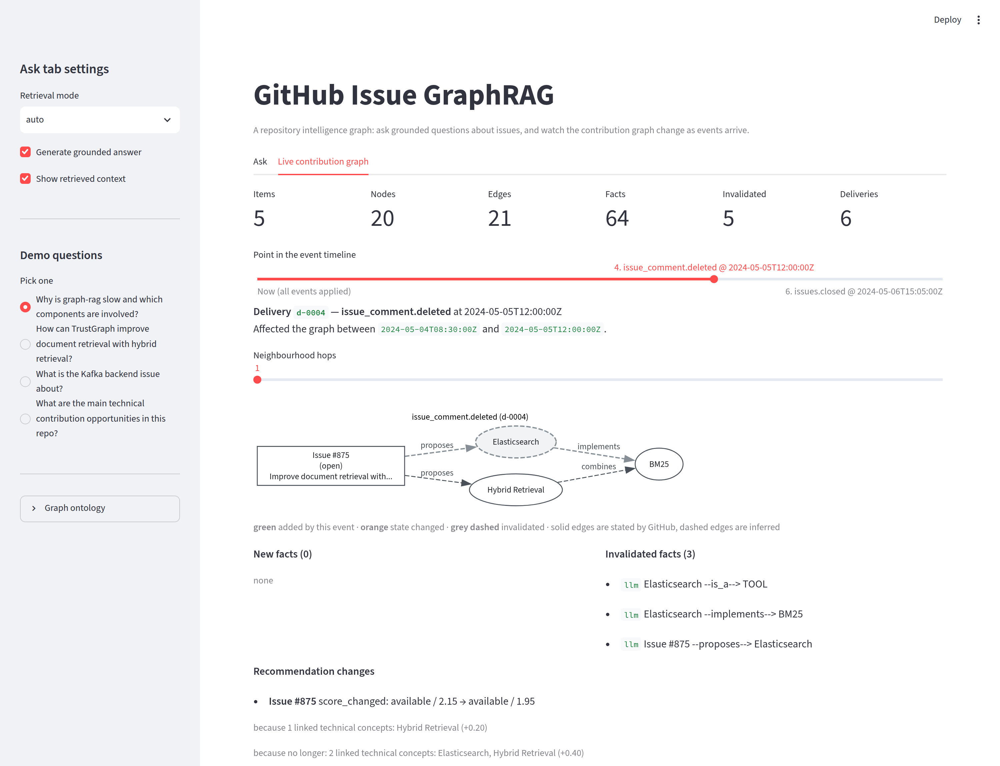
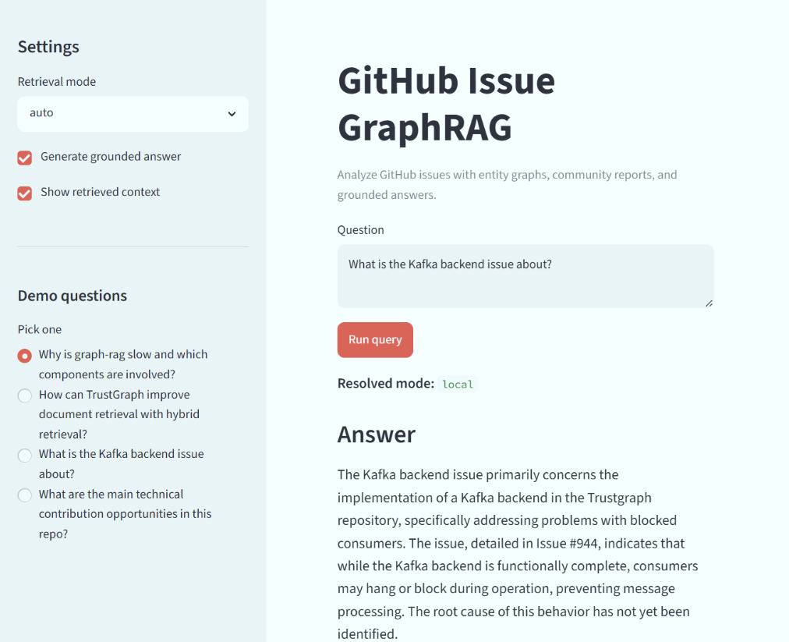

# GitHub Issue GraphRAG

[](https://github.com/YingzuoLiu/github-issue-graphrag/actions/workflows/ci.yml)
[](pyproject.toml)
[](LICENSE)

An event-driven repository intelligence graph that connects issues, discussions, pull requests
and code modules to explain what changed, why it matters, and where contributors can act next.

The project has two halves:

- **Batch GraphRAG index (v0.1, complete).** Turns a snapshot of GitHub issues into an entity
  graph with community reports, and answers contribution-oriented questions with grounded context.
- **Live contribution graph (v0.3).** Receives signed GitHub webhooks through a durable inbox and
  applies them to a versioned, ontology-checked fact store, so the graph updates incrementally and
  can say how each event moved the recommendations. See
  [Live contribution graph](#live-contribution-graph-v03).

The demo dataset is TrustGraph, but both halves work against any GitHub repository.



## Run it now

After cloning and installing dependencies, the replay itself needs no API key, network access,
Docker or vector database. The shipped fixtures replay a small repository story through the live
indexing core; they bypass the HTTP receiver, durable inbox and real LLM calls:

```bash
git clone https://github.com/YingzuoLiu/github-issue-graphrag
cd github-issue-graphrag
python -m pip install -e .
python scripts/replay_events.py --verify-rebuild
```

After replaying seven normalized webhook fixtures:

```text
[d-0004] issue_comment.deleted @ 2024-05-05T12:00:00Z
-----------------------------------------------------
  affected documents : trustgraph-ai/trustgraph#issue-875
  re-extracted       : trustgraph-ai/trustgraph#issue-875
  invalidated  [llm] Elasticsearch --is_a--> TOOL
  invalidated  [llm] Elasticsearch --implements--> BM25
  invalidated  [llm] Issue #875 --proposes--> Elasticsearch
  nodes +0 -1
  edges +0 -2
  recommendation score_changed: Issue #875 available/2.15 -> available/1.95
      because 1 linked technical concepts: Hybrid Retrieval (+0.20)
      because no longer: 2 linked technical concepts: Elasticsearch, Hybrid Retrieval (+0.40)

Replayed 7 deliveries (6 applied, 1 skipped): 20 nodes, 21 edges, 68 facts (9 invalidated)
Rebuild consistency (recorded extraction, deterministic layer rebuilt): PASS
```

Three things in that output are the point of the project:

1. **A deleted comment retires its inferences instead of erasing them.** The facts are closed with
   a `valid_to`, so `--as-of` can still project the graph as it stood before the deletion.
2. **The ranking explains itself.** Every score change names the signal that moved it, and the
   signals are a fixed arithmetic table, not a model call.
3. **`PASS` is a check that can fail.** Replaying six events incrementally and rebuilding the
   whole deterministic layer from scratch land on the same graph fingerprint — one that includes
   edge direction, per-relation origin and evidence, so a reversed `closes` edge or a fact that
   lost its provenance would fail it.

Then ask the graph what to work on:

```bash
python scripts/contribution_report.py
```

```text
Contribution opportunities (now)
===============================

   1.95  available  Issue #875  Improve document retrieval with hybrid retrieval
         https://github.com/trustgraph-ai/trustgraph/issues/875
         - open issue (+1.00)
         - labeled good first issue (+0.75)
         - 1 linked technical concepts: Hybrid Retrieval (+0.20)
```

The Streamlit app (`pip install -e ".[app]" && streamlit run app.py`) puts the same replay behind
a timeline scrubber. After installation, everything above runs offline; only the batch index and
`--llm` extraction need a provider key.

## Contents

| Section | What is in it |
|---|---|
| [What this project does](#what-this-project-does) | The two pipelines, end to end |
| [Why GraphRAG instead of plain RAG?](#why-graphrag-instead-of-plain-rag) | What the graph layer buys |
| [Setup](#setup) | Install, `.env`, provider configuration |
| [Build an index](#build-an-index) | Batch pipeline over a real repository |
| [Live contribution graph](#live-contribution-graph-v03) | Fact versioning, two clocks, ontology, webhook path |
| [Retrieval evaluation](#retrieval-evaluation) | Measured BM25 / dense / RRF hybrid numbers |
| [Known limitations](#known-limitations) | What this is not, in detail |
| [Future work](#future-work) | What would come next |

## Measured results

Two things in this repository are measurements rather than descriptions, and both ship with their
raw output and their caveats.

**Retrieval, 12 annotated questions over a 33-TextUnit snapshot** ([full report](eval/results.md)):

| mode | entity recall | source R@8 | source MRR | median query ms |
|---|---:|---:|---:|---:|
| BM25 (`naive`) | 0.847 | 0.944 | 0.861 | 0.17 |
| Dense vector | 0.731 | 0.903 | 0.778 | 9.24 |
| RRF hybrid | 0.847 | 0.944 | **0.882** | 12.18 |

Hybrid preserved BM25's recall and improved MRR; the pure dense baseline did not beat BM25 on a
corpus full of issue numbers and file names. Twelve questions is too small for broad claims — see
[the full discussion](#measured-lexicaldensefusion-baseline).

**Read-only pilot, 3 real repositories, 9 GET requests, 0 writes**
([method and limitations](docs/real-repo-pilot.md)): the first run exposed a real schema omission —
assigned issues were still being called available. See
[the read-only real-repository pilot](#read-only-real-repository-pilot) for what that ablation does
and does not support.

**Contribution regression evidence, 1 frozen real Graphiti snapshot:** 25 issues and 25 pull
requests replay offline in CI, locking recommendation ordering, status, score, reasons and evidence.
The separate live pilot now writes immutable timestamped reports and runs weekly as read-only
monitoring; changing current GitHub data cannot silently rewrite the deterministic release gate.

## What this project does

The batch pipeline turns GitHub issues into a small repository knowledge graph:

```text
GitHub issues
  ↓
TextUnit chunking
  ↓
LLM entity / relationship extraction
  ↓
Entity normalization
  ↓
Graph construction
  ↓
Graph-level normalization
  ↓
Community detection
  ↓
Community report generation
  ↓
Local / global / BM25 retrieval
  ↓
Grounded answer generation
```

The live pipeline keeps that graph current as the repository moves:

```text
GitHub webhook delivery
  ↓
raw-body signature + repo checks      (deterministic HTTP path)
  ↓
durable SQLite inbox + delivery id    (deterministic, then HTTP 202)
  ↓
worker retry + PR files hydration     (deterministic I/O)
  ↓
record update: issue / PR / comment   (deterministic)
  ↓
GitHub-stated facts, repo-wide        (deterministic)
  ↓
scoped LLM extraction, changed docs only
  ↓
ontology validation
  ↓
fact upsert / invalidate with validity windows
  ↓
graph projection + contribution ranking
  ↓
"what changed, and why it matters"
```

The goal is not to build a perfect industrial knowledge graph. The goal is to demonstrate a practical GraphRAG pipeline with debugging tools, normalization, and explainable retrieval.

## Why GraphRAG instead of plain RAG?

Plain RAG usually retrieves chunks directly from text.

GraphRAG adds an intermediate structure:

- entities: files, modules, APIs, features, algorithms, issues, tools
- relationships: uses, depends_on, improves, conflicts_with, implements, proposes
- communities: clusters of related technical topics
- reports: summaries of each technical area

This makes it easier to answer questions like:

- What are the main contribution opportunities in this repo?
- Why is graph-rag slow and which components are involved?
- How can document retrieval be improved with hybrid retrieval?
- What is the Kafka backend issue about?

## Demo UI

The Streamlit demo provides a small interface for selecting retrieval mode, running demo questions, generating grounded answers, and inspecting retrieved context.



## Current features

**Batch GraphRAG index**

| Area | What is implemented |
|---|---|
| Ingestion | GitHub issue fetching, TextUnit chunking |
| LLM plumbing | OpenAI-compatible client (tested with OpenRouter), fenced-JSON parsing, retry on unstable calls |
| Extraction | Entity and relationship extraction, then normalization of aliases such as `RRF` / `Reciprocal Rank Fusion`, `Graph-RAG` / `graph_rag` / `Graph RAG`, `TrustGraph` / `TG` |
| Graph | Graph-level normalization after construction, community detection, community reports covering technical theme, key entities, contribution opportunities, and evidence/uncertainty |
| Debugging | `inspect_graph.py` and `inspect_relations.py` for entity and relation quality |
| Retrieval | Local GraphRAG, global community-report, BM25 lexical baseline, optional dense TextUnit retrieval on embedded Qdrant |
| Evaluation | Offline BM25 / vector / RRF hybrid comparison harness with committed results |
| Answers | Grounded generation with `--answer`, plus a Streamlit demo app |

**Live contribution graph (v0.3, productization on `0.4.0.dev0`)**

| Area | What is implemented |
|---|---|
| Ingestion boundary | HTTP endpoint that verifies the exact raw body and allowlists one repository per process; repository-qualified SQLite inboxes with delivery-id dedup, leases, retries and dead letters; a separate worker, so GitHub is acknowledged after enqueue and never waits for an LLM |
| Payload handling | Issue, pull request and comment ingestion including lock state, native dependency counts and changed files, with paginated PR file hydration — including PRs first seen through a comment |
| Time model | Immutable fact versions with `valid_from` / `valid_to`, so history stays queryable and historical projections never borrow later knowledge; source-clock record versioning, so stale, partial and out-of-order payloads all converge |
| Correctness | An explicit ontology separating who may assert a predicate from whether the assertion is legal; a rebuild consistency check fingerprinting direction and provenance |
| Cost control | Incremental indexing that re-extracts only the documents whose text changed |
| Output | Deterministic contribution scoring with per-signal reasons and source links, deterministic fixture replay, a configured repository selector, freshness metadata and a Streamlit timeline of the affected subgraph |

## Setup

Create and activate a virtual environment:

```bash
python -m venv .venv

source .venv/bin/activate         # macOS / Linux
.\.venv\Scripts\Activate.ps1      # Windows PowerShell
source .venv/Scripts/activate     # Windows Git Bash
```

Install. The base install is enough for the fixture replay, the graph inspection scripts and the
test suite:

```bash
python -m pip install -e .
```

Add extras as you need them:

| Command | Adds |
|---|---|
| `pip install -e ".[app]"` | Streamlit demo app |
| `pip install -e ".[embeddings,vector]"` | Embedded Qdrant vector index |
| `pip install -e ".[dev]"` | pytest, ruff, mypy, and everything above except embeddings |

Python 3.10 or newer is required; CI runs 3.10 and 3.12.

Copy the environment file:

```bash
cp .env.example .env
```

Example `.env` for OpenRouter:

```env
LLM_PROVIDER=openai-compatible
LLM_BASE_URL=https://openrouter.ai/api/v1
LLM_API_KEY=your-api-key-here
LLM_MODEL=your-model-name-here

EMBEDDING_PROVIDER=sentence-transformers
EMBEDDING_MODEL=sentence-transformers/all-MiniLM-L6-v2

VECTOR_DB_PATH=data/processed/qdrant
VECTOR_COLLECTION=issue_graphrag

RAW_DATA_DIR=data/raw
PROCESSED_DATA_DIR=data/processed
```

Do not commit `.env`.

## Build an index

Fetch issues:

```bash
python scripts/fetch_github_issues.py trustgraph-ai/trustgraph --state open --limit 20
```

Build the graph index:

```bash
python scripts/build_index.py trustgraph-ai__trustgraph_issues.json
```

Example successful output:

```text
Built index in data\processed
{'nodes': 230, 'edges': 187, 'connected_components': 54}
```

Build the optional vector index after the graph index exists:

```bash
python scripts/build_vector_index.py --batch-size 32
```

This uses Qdrant client local mode and persists the collection under
`data/processed/qdrant/`; it does not require a Qdrant server or Docker. The index stores
TextUnits, entities, and community reports with stable UUIDv5 point IDs, so rebuilding the same
logical records uses idempotent upserts.

`sentence-transformers/all-MiniLM-L6-v2` is used as a lightweight English baseline because the
demo corpus is made of English GitHub issues and the model is practical on a local CPU. It is a
speed and reproducibility choice, not a claim that it is the best production embedding model.
The build command reports model-loading, document-loading, and embedding/upsert time separately.

## Inspect graph quality

Inspect the graph:

```bash
python scripts/inspect_graph.py --top-n 20
```

Inspect a specific entity:

```bash
python scripts/inspect_graph.py --entity "Graph RAG"
python scripts/inspect_graph.py --entity "Hybrid Retrieval"
python scripts/inspect_graph.py --entity "Kafka"
```

Inspect relation quality:

```bash
python scripts/inspect_relations.py --relation improves
python scripts/inspect_relations.py --relation uses
python scripts/inspect_relations.py --relation depends_on
```

These scripts are important because LLM-extracted graphs are noisy. The project explicitly treats graph construction as a debuggable pipeline, not as a perfect one-shot extraction.

## Regenerate community reports

If the graph already exists and only the community report prompt changed, regenerate reports without re-running extraction:

```bash
python scripts/regenerate_reports.py
```

This updates:

```text
data/processed/community_reports.json
```

without rebuilding the full graph.

## Live contribution graph (v0.3)

The batch index answers "what is in this repository". It cannot answer the question a
contributor actually has the next morning:

> The opportunity I saw yesterday — has someone opened a PR for it? Did a new comment reveal a
> blocker? Has the approach I was going to take already been superseded?

v0.3 answers that by applying GitHub events to a versioned fact store. The differentiator is
not that there is a picture of a graph on the page. It is that **the graph updates incrementally
when the repository changes, and explains how those changes move the contribution opportunities.**
(The Streamlit timeline view is [pictured at the top of this README](#github-issue-graphrag).)

### Read-only real-repository pilot

A timestamped Pilot 0 ran the deterministic layer against 50 issues and 50 open PRs from each of
Graphiti and PydanticAI, plus all 17 open TrustGraph issues. It made nine GitHub GET requests and
zero measured writes. The first run exposed a real schema omission: assigned issues were still
called available. In the refreshed report, a same-snapshot ablation produces 13.0% / 82.9% /
12.5% platform-constraint contradiction rates when assignee facts are suppressed; the current
graph has zero such contradictions and causal evidence links for every non-available result.

This is an engineering consistency check, not an independent quality benchmark or user study.
Assignee and closing-PR signals overlap production behavior; the two non-overlapping signals
(locked issues and native dependencies) did not occur in the sample. Fixed-denominator P@10 is
100% / 70% / 100% in the refreshed report; the reviewed Pydantic snapshot should have been 6/10,
not 6/6. Inspection depth beat GitHub's curated baseline in Graphiti and tied it in PydanticAI and
TrustGraph, so the data does not support a general human-efficiency claim. See the
[method and limitations](docs/real-repo-pilot.md), the
[initial failure](eval/pilot_results_before_assignee.md), and the
[corrected post-fix report](eval/pilot_results_after_assignee.md).

### The design rule

Expensive work is scoped. Cheap work is not.

- **Scoped:** LLM extraction runs only for documents whose text actually changed, and community
  reports regenerate only for communities whose membership changed. These are the calls that cost
  money and latency.
- **Not scoped:** GitHub-stated facts are re-derived for every document on every event, and the
  graph is folded fresh from the fact set. Both are pure string and dictionary work measured in
  microseconds.

Re-deriving the cheap layer removes an entire class of ordering bugs — an issue that mentions
`#950` only gains that edge once the index has seen PR #950 — and it is why an incremental replay
and a full rebuild land on the same graph *by construction* rather than by luck.

### Two clocks

Deriving the graph in a fixed order is not enough on its own, because the *records* the graph is
derived from can also be overwritten out of order. So the index keeps two clocks apart:

| Clock | What it is | What it decides |
|---|---|---|
| `effective_at` | the newest timestamp GitHub reports for a record | which payload wins; an older payload can never overwrite newer state, whenever it arrives |
| `indexed_at` | logical ingestion order, forced strictly monotonic at one-second precision | when a fact's validity window opens |

Every present field carries its own `(effective_at, delivery_id)` source version. Ties resolve the
same way in either arrival order without letting one partial payload hide fields that only another
webhook shape carries. Deleted comments leave a versioned tombstone: a late `created` cannot
resurrect a deletion, while an old delayed `deleted` event cannot erase a newer edit. The result is
that applying a set of deliveries in *any* order converges on the same records and the same graph —
which is a test, not a hope (`test_out_of_order_deliveries_converge_on_the_same_graph`).

A partial payload is merged field by field rather than rebuilt wholesale. This matters more than it
sounds: GitHub delivers pull request comments under the `issue` key, with no `merged`, `merged_at`
or `draft` fields at all. Rebuilding the record from that payload silently demotes a merged pull
request to a plain closed one, and the issue it closed stops looking claimed.

### Deterministic vs inferred

The split is enforced by an explicit ontology (`src/issue_graphrag/live/ontology.py`), not by
convention. There are two separate guard rails, and conflating them leaves a hole:

- **Origin** decides *who may assert* a predicate. An inferred fact claiming `closes` is rejected
  outright and the rejection is reported. This rule is time-invariant, so it is enforced when the
  fact is written.
- **Domain and range** decide whether an assertion is *legal at all*, and they apply to every fact
  regardless of origin — a regex is perfectly capable of producing `Issue #1 closes Issue #2` from
  an issue body that says "fixes #2". This rule depends on node types, which are knowledge the
  index acquires over time, so it is enforced at projection time where it stays a pure function of
  the current fact set. The deterministic path is also fixed at the source: a closing keyword only
  means `closes` when a pull request is the one saying it.

| Deterministic (GitHub payload only) | Inferred (LLM, then schema-checked) |
|---|---|
| webhook signature and delivery-id dedup | technical entities in new comments |
| issue / PR state, labels, assignees, lock/dependency status, timestamps | whether two discussions are semantically related |
| explicit `#123` references, `closes`, `blocked by` | `proposes` / `supersedes` / `conflicts_with` |
| files a PR touches, module a file belongs to | what a change means for the surrounding area |
| fact upsert, invalidation, replay, event log | narrative summaries in community reports |
| affected-document selection | — |
| contribution scoring and its reasons | — |
| source links and validity windows | — |

The schema is small on purpose:

- **Node types:** `ISSUE`, `PULL_REQUEST`, `FILE`, `MODULE`, `CONTRIBUTOR`, plus open concept types.
- **GitHub predicates:** `has_state`, `has_label`, `is_locked`, `has_blocking_dependencies`,
  `references`, `closes`, `blocked_by`, `touches`, `belongs_to`, `assigned_to`.
- **Inferred predicates:** `implements`, `conflicts_with`, `supersedes`, `proposes`, `improves`,
  `depends_on`, `uses`, `affects`, and friends. Anything outside the vocabulary folds into
  `related_to` rather than growing it.

Inspect it with `python scripts/replay_events.py --show-ontology`.

### Facts are immutable versions

A fact is written once and then only ever closed. Three outcomes, and no fourth:

| Situation | What happens |
|---|---|
| a new assertion | append an open version |
| the assertion no longer holds | close it with `valid_to` |
| the assertion holds but its evidence moved | close the old version, append a new one |
| the assertion is re-derived unchanged | **nothing at all** |

That last row is the one that makes time travel trustworthy. If re-observing a fact updated it in
place, an unrelated event on the other side of the repository would make every fact look freshly
confirmed, and reading the graph at an earlier moment would surface evidence that was edited into
existence later. Counting observations is a separate concern; it must not touch the assertion.

Each version carries `valid_from`, `valid_to`, its origin, the delivery that asserted it, the
delivery that closed it, and evidence pointing at the issue body, comment or pull request behind
it. The current graph is the projection of versions with an open window; any earlier graph is the
same projection at an earlier moment.

**A historical projection reads nothing but facts.** Both pieces of knowledge that grow over time —
that `#950` turned out to be a pull request, and which chunk of text a fact was grounded in — are
resolved from the facts valid at the moment being projected, never from current records. Otherwise
querying "what did we know last Tuesday" would answer with today's knowledge.

### Run the demo

The shipped fixtures replay a small story: a comment proposes a new approach, a pull request picks
up an issue, a drive-by suggestion is added and then deleted, the pull request merges, the issue
closes, and GitHub redelivers an event it already sent.

```bash
python scripts/replay_events.py --verify-rebuild
```

`--verify-rebuild` re-derives the whole deterministic layer from the records and replays the
*recorded* extraction output, then compares graph fingerprints. That makes it a statement about
this pipeline — the fact lifecycle, the deterministic derivation and the projection must reach the
same graph whether they got there in six steps or one — rather than a statement about the model.
`--re-extract` additionally re-runs extraction; with the fixture extractor that is a useful
stability check, but against a live model it measures the model's repeatability, so it is reported
separately and never as a consistency guarantee. Making a live model reproducible here would mean
caching extraction output keyed by document signature, model id and prompt version; that is listed
under future work, not claimed.

The fingerprint includes edge direction, per-relation origin and evidence. An earlier version
compared only undirected relation labels, which meant a reversed `closes` edge or a fact that had
lost its provenance could still report a clean PASS.

```text
Bootstrapped trustgraph-ai/trustgraph: 4 items, 14 nodes, 12 edges

[d-0004] issue_comment.deleted @ 2024-05-05T12:00:00Z
-----------------------------------------------------
  affected documents : trustgraph-ai/trustgraph#issue-875
  re-extracted       : trustgraph-ai/trustgraph#issue-875
  invalidated  [llm] Elasticsearch --is_a--> TOOL
  invalidated  [llm] Elasticsearch --implements--> BM25
  invalidated  [llm] Issue #875 --proposes--> Elasticsearch
  nodes +0 -1
  edges +0 -2
  recommendation score_changed: Issue #875 available/2.15 -> available/1.95
      because 1 linked technical concepts: Hybrid Retrieval (+0.20)
      because no longer: 2 linked technical concepts: Elasticsearch, Hybrid Retrieval (+0.40)

Replayed 7 deliveries (6 applied, 1 skipped): 20 nodes, 21 edges, 68 facts (9 invalidated)
Rebuild consistency (recorded extraction, deterministic layer rebuilt): PASS
```

Then query it:

```bash
# what to work on now, and why each item scores what it does
python scripts/contribution_report.py

# the same question, as the graph stood mid-replay
python scripts/contribution_report.py --as-of 2024-05-04T12:00:00Z

# one node with the evidence behind every edge
python scripts/contribution_report.py --explain "Issue #944"

# every fact ever asserted about a node, including retired ones
python scripts/contribution_report.py --history Elasticsearch
```

To run it against a real repository instead of the fixtures:

```bash
python scripts/fetch_live_seed.py trustgraph-ai/trustgraph --state all --limit 30
python scripts/replay_events.py \
  --seed data/repos/trustgraph-ai__trustgraph/bootstrap_seed.json \
  --events path/to/captured/events \
  --llm
```

`fetch_live_seed.py` keeps pull requests, comments and changed files, which
`fetch_github_issues.py` deliberately drops. `--llm` swaps the offline fixture extractor for the
configured provider.

### The five properties this has to satisfy

Each one is a test, not a claim (`tests/test_live_indexer.py`):

| Property | Test |
|---|---|
| Replaying one delivery twice moves the graph once | `test_redelivering_the_same_event_changes_the_graph_only_once` |
| A deleted or edited comment retires its inferences, history stays queryable | `test_comment_deletion_invalidates_inferred_facts_but_keeps_history` |
| Merging a PR or closing an issue actually changes the recommendations | `test_merged_pull_request_and_closed_issue_change_recommendations` |
| Incremental replay equals a full rebuild | `test_incremental_replay_matches_a_full_rebuild` |
| Every inferred relation traces to a specific issue, comment or PR | `test_every_inferred_fact_is_traceable_to_a_source` |

Being replayable and convergent needs more than that, so `tests/test_live_temporal.py` pins the
properties that make the word "temporal" honest:

| Property | Test |
|---|---|
| A past moment does not know what the index learned later | `test_a_past_moment_does_not_know_that_a_number_became_a_pull_request` |
| A past moment does not cite text written later | `test_a_past_moment_does_not_cite_text_written_later` |
| Changed evidence appends a version instead of editing one | `test_changed_evidence_appends_a_version_instead_of_editing_one` |
| An unrelated event does not touch a fact | `test_an_unchanged_fact_is_not_touched_by_an_unrelated_event` |
| Deliveries in any order converge on the same graph | `test_out_of_order_deliveries_converge_on_the_same_graph` |
| A stale payload cannot rewind state | `test_a_stale_payload_cannot_rewind_state` |
| A comment on a merged pull request keeps it merged | `test_a_comment_on_a_merged_pull_request_keeps_it_merged` |
| A deleted comment is not resurrected by a late create | `test_a_deleted_comment_is_not_resurrected_by_a_late_create` |
| A stale delete cannot erase a newer comment edit | `test_a_stale_delete_cannot_remove_a_newer_comment_edit` |
| A deletion wins an equal-timestamp edit tie in either order | `test_comment_delete_wins_same_timestamp_tie_in_either_order` |
| Same-timestamp partial PR payloads converge in either order | `test_same_timestamp_partial_pr_payloads_converge_in_either_order` |
| Same-second events keep distinct history windows | `test_events_received_in_the_same_second_get_distinct_history_windows` |
| The fingerprint can actually fail, on direction and on evidence | `test_signature_distinguishes_edge_direction`, `test_signature_distinguishes_evidence` |
| Same-named files in different directories stay separate | `test_same_named_files_in_different_directories_stay_separate` |
| A closing keyword in an issue is a reference, not a close | `test_a_closing_keyword_in_an_issue_is_a_reference_not_a_close` |

The real receiver and worker add another set of executable guarantees:

| Property | Test |
|---|---|
| A delivery is durably stored before HTTP acknowledges it | `test_receiver_verifies_and_enqueues_without_processing` |
| Reusing a delivery id for different input is rejected | `test_inbox_deduplicates_a_delivery_and_rejects_id_reuse` |
| A dead worker's lease is reclaimed without concurrent state writers | `test_only_one_delivery_can_be_processing_and_an_expired_lease_is_reclaimed` |
| A crash between state and audit log does not repeat extraction | `test_crash_after_state_write_recovers_without_duplicate_extraction_or_log` |
| Pull request files are paginated and become replay input | `test_pull_request_files_are_paginated_and_canonicalized`, `test_worker_hydrates_pull_request_files_before_indexing` |
| An incomplete unauthenticated request cannot hold a handler forever | `test_http_adapter_times_out_an_incomplete_request_body` |
| Audit-log idempotency does not rescan the full JSONL on every append | `test_event_log_append_once_uses_a_warm_delivery_index` |
| A transient iteration failure does not terminate the daemon | `test_worker_loop_survives_an_iteration_failure_and_keeps_processing` |

```bash
python -m pytest tests/test_live_indexer.py tests/test_live_temporal.py -v
python scripts/replay_events.py --verify-rebuild   # the same rebuild check from the CLI
```

### Contribution scoring

The ranking is a small auditable formula over the projected graph, with no model in the loop, so
every change can be explained:

| Signal | Effect |
|---|---|
| open issue | +1.00 |
| `good first issue` / `help wanted` / `documentation` | +0.75 |
| linked technical concepts | +0.20 each, capped at 5 |
| an open or merged pull request closes or references it | −2.00, status `claimed` |
| open blocker, locked conversation or native blocking dependency | −1.50 once, status `blocked` unless already `claimed` |
| issue is closed | drops out of the ranking |

### Run the real webhook path

Configure the repositories shown in the UI, plus the repository owned by this receiver/worker
lane, and set a high-entropy secret in `.env`:

```dotenv
GITHUB_REPOS=owner/name,other/repository
GITHUB_WEBHOOK_REPO=owner/name
GITHUB_WEBHOOK_SECRET=replace-me
GITHUB_TOKEN=optional-token-for-private-repos-and-higher-rate-limits
```

If possible, bootstrap the existing repository before switching to events; otherwise the live
state correctly knows only the issues and pull requests delivered after it started:

```bash
python scripts/fetch_live_seed.py owner/name --state all --limit 100
mkdir -p data/empty-events
python scripts/replay_events.py \
  --seed data/repos/owner__name/bootstrap_seed.json \
  --events data/empty-events
```

Run the receiver and worker as separate processes:

```bash
python scripts/serve_webhooks.py --host 0.0.0.0 --port 8000
python scripts/process_webhooks.py --llm
```

Register `https://your-host/webhooks/github` for `issues`, `pull_request`, `issue_comment` and
`issue_dependencies`. Dependency deliveries are hydrated through GitHub's read-only REST API
because their webhook payload identifies the related issues but does not include the active count.
The included server is a small HTTP reference endpoint; put it behind a TLS reverse proxy that
also enforces connection limits and rate limits. The endpoint itself bounds request reads to 30
seconds by default (`--read-timeout-seconds`) so an unauthenticated slow client cannot pin a handler
thread indefinitely. It answers `202` only after the exact signed payload is committed to SQLite.
The request path does not call GitHub or the LLM. The worker then leases one delivery, fetches every
page of PR files, applies the index, atomically replaces state, appends the audit event once, and
marks the delivery succeeded. Run `--rules fixtures/live_demo/extraction_rules.json` for
deterministic rules, omit both extraction flags for GitHub facts only, or use `--llm` for the
configured model.

GitHub recommends acknowledging webhooks within ten seconds and processing them asynchronously;
it also says failed deliveries are **not automatically redelivered**. The inbox retries local
processing failures, while an exhausted delivery becomes a dead letter. Requeue it with:

```bash
python scripts/process_webhooks.py --retry-failed --once
python scripts/process_webhooks.py --status
```

Each repository has an independent inbox, state, event log, extraction-cache path and freshness
record below `data/repos/<owner>__<name>/`. Bootstrap follows pagination for issues/PRs, comments
and pull-request files with explicit CLI caps stored in the seed. See
[`docs/repository-isolation.md`](docs/repository-isolation.md) for the layout, cap controls and
freshness semantics. Start a separate receiver/worker pair with `--repo` for each active lane.

For a delivery GitHub never successfully sent, use GitHub's delivery UI/API within its documented
retention window. See GitHub's
[webhook best practices](https://docs.github.com/en/webhooks/using-webhooks/best-practices-for-using-webhooks)
and [redelivery documentation](https://docs.github.com/en/webhooks/testing-and-troubleshooting-webhooks/redelivering-webhooks).

### What v0.3 deliberately does not do

- It does not yet authenticate as a GitHub App and poll the delivery-history API for missed
  deliveries. Local processing retries are automatic; source-side backfill remains an explicit
  operator action.
- The inbox gives at-least-once processing, not exactly-once model billing. A crash before the
  state commit can repeat an LLM request; a persistent extraction cache is the fix for that.
- Each repository-qualified local JSON state has one serialized worker. Separate repository lanes
  are isolated, but this is not pretending to be a distributed queue or a cross-repository graph.
- Storage is still local JSON. The fact model is designed so a graph database can replace the
  projection later, but swapping in Neo4j now would add operational weight without answering a
  new question.
- The shipped `fixtures/live_demo/extraction_rules.json` contains hand-authored substring rules,
  **not recorded model output**. They exist so the incremental behaviour, provenance and
  invalidation can be replayed deterministically without an API key. Use `--llm` for real
  extraction.
- Contribution scoring only ranks issues. A pull request that needs review is arguably an
  opportunity too, and is not modelled yet.
- Community reports are not refreshed during replay. The scoped-regeneration helper exists and is
  fingerprinted correctly, but nothing calls it from the event loop.

## Run the Streamlit demo

```bash
python -m pip install -e ".[app]"
streamlit run app.py
```

The app has two tabs:

- **Ask** — choose a retrieval mode, run demo questions, generate grounded answers, and inspect
  the retrieved local/global context. Retrieval settings live in the sidebar. Needs
  [a batch index](#build-an-index), which needs a provider key; the tab says so rather than
  failing if one has not been built.
- **Live contribution graph** — scrub through the replayed event timeline, see the 1–2 hop
  neighbourhood each event touched (green added, orange state changed, grey dashed invalidated),
  read the facts that appeared and retired, and watch the contribution ranking move with the
  reason attached. Needs only `python scripts/replay_events.py`, which runs offline.

## Query modes

### Local GraphRAG

Best for specific technical questions.

```bash
python scripts/query.py "Why is graph-rag slow and which components are involved?" --mode local
```

With grounded answer generation:

```bash
python scripts/query.py "Why is graph-rag slow and which components are involved?" --mode local --answer
```

### Global GraphRAG

Best for broad overview questions.

```bash
python scripts/query.py "What are the main technical contribution opportunities in this repo?" --mode global
```

With answer generation:

```bash
python scripts/query.py "What are the main technical contribution opportunities in this repo?" --mode global --answer
```

### BM25 lexical baseline

Useful as a stronger lexical comparison baseline. The CLI mode is still named `naive` for compatibility, but the implementation uses `rank_bm25.BM25Okapi`.

```bash
python scripts/query.py "What is the Kafka backend issue about?" --mode naive
```

## Demo questions

### 1. Graph-RAG latency

```bash
python scripts/query.py "Why is graph-rag slow and which components are involved?" --mode local --answer
```

Expected answer should mention:

- `tg-invoke-graph-rag`
- `graph_rag.Processor`
- `Pulsar`
- `TriplesClientSpec`
- `triples-query-memgraph`
- `Memgraph`
- sequential Pulsar-mediated triples-query calls
- possible fixes such as direct Bolt traversal or batched triples-query

### 2. Hybrid retrieval

```bash
python scripts/query.py "How can TrustGraph improve document retrieval with hybrid retrieval?" --mode local --answer
```

Expected answer should mention:

- Document-RAG currently relying on semantic/vector retrieval
- BM25 keyword retrieval
- vector + keyword fusion
- RRF
- possible backends such as Elasticsearch, OpenSearch, or SQLite FTS5

### 3. Kafka backend issue

```bash
python scripts/query.py "What is the Kafka backend issue about?" --mode local --answer
```

Expected answer should mention:

- Issue #944
- Kafka backend consumers hanging/blocking
- `kafka_backend.py`
- `Consumer` / `Producer`
- `unsubscribe()` as a potential footgun
- missing integration/e2e tests

### 4. Contribution opportunities

```bash
python scripts/query.py "What are the main technical contribution opportunities in this repo?" --mode global --answer
```

Expected answer should mention areas such as:

- Graph-RAG latency optimization
- Hybrid retrieval
- Cross-encoder reranking
- Kafka backend reliability
- Workspace export/import
- config-as-code / configuration management
- knowledge extraction documentation or testing
- provider-specific RAG output parsing

## Retrieval evaluation

The repository includes a manually annotated retrieval set covering exact issue lookup,
local relationship questions, and broad repository themes. Each case records expected entities
and source issue document IDs; global-theme cases also record entities expected in selected
community reports.

Run the current BM25, local GraphRAG, and global community-report baselines with:

```bash
python scripts/evaluate_retrieval.py --top-k 8 --repeats 3
```

After building the optional vector index, run the isolated lexical/dense/fusion experiment with:

```bash
python scripts/evaluate_retrieval.py \
  --modes naive vector hybrid \
  --top-k 8 \
  --repeats 3 \
  --fusion-depth 20 \
  --rrf-k 60
```

These experiment-only modes are deliberately not added to `scripts/query.py`, the Streamlit mode
selector, or the Local/Global GraphRAG paths. `BM25Retriever` builds its tokenized corpus once per
evaluation run. Vector retrieval embeds each query and ranks pre-indexed TextUnits from Qdrant.
Hybrid retrieval uses Reciprocal Rank Fusion instead of combining incomparable BM25 and cosine
scores directly.

`rrf_k=60` is a named, conventional default and has not been tuned on this small evaluation set.
The candidate depth is also explicit so it can be varied without silently changing the fusion
behavior.

The script writes detailed CSV and Markdown reports under `eval/` and reports:

- entity coverage in retrieved context
- source-document Recall@K and reciprocal rank
- community entity coverage and reciprocal rank for global questions
- a context-noise proxy based on unexpected graph entities
- median warm-query retrieval latency
- one-time BM25 construction, embedding-model loading, and Qdrant opening time

The vector-index build command reports embedding and upsert time separately from query evaluation.
The embedded Qdrant results are a reproducible local baseline, not a claim about distributed or
production-scale ANN performance. The project reports measured timings rather than asserting a
strict asymptotic complexity improvement.

For global retrieval, source recall covers documents attached to the selected top-k community
reports. Source MRR is intentionally left undefined because the source order inside one report is
not a retrieval ranking.

### Measured lexical/dense/fusion baseline

The committed [Markdown report](eval/results.md) and [CSV details](eval/results.csv) capture a
local CPU reference run over 12 annotated questions and the current 33-TextUnit demo snapshot.
The run used `top_k=8`, three latency repetitions, `fusion_depth=20`, and the untuned
`rrf_k=60` default.

| mode | entity recall | source R@8 | source MRR | median query ms |
|---|---:|---:|---:|---:|
| BM25 (`naive`) | 0.847 | 0.944 | 0.861 | 0.17 |
| Dense vector | 0.731 | 0.903 | 0.778 | 9.24 |
| RRF hybrid | 0.847 | 0.944 | 0.882 | 12.18 |

On this small corpus, hybrid retrieval preserved BM25's entity and source recall while improving
source MRR from 0.861 to 0.882. The pure dense baseline did not outperform BM25, and both dense
modes had higher warm-query latency. This is consistent with technical issue questions containing
exact issue numbers, file names, configuration keys, and other identifiers that favor lexical
matching.

These results are a small reference experiment, not evidence of production-scale ANN performance
or a strict asymptotic complexity improvement. Latency is hardware- and cache-dependent, and the
12-question set is too small for broad statistical claims. Community metrics are `n/a` for these
three modes because they rank TextUnits rather than community reports.

## Project structure

```text
src/issue_graphrag/
  config.py
  models.py
  chunker.py
  prompts.py
  llm/
    client.py
    json_utils.py
  indexing/
    extractor.py
    normalizer.py
    graph_builder.py
    graph_normalizer.py
    community.py
    report_generator.py
    vector_documents.py
  retrieval/
    naive_search.py
    vector_search.py
    hybrid_search.py
    local_search.py
    global_search.py
  storage/
    json_store.py
    vector_store.py
    qdrant_store.py
  ingest/
    github_loader.py
  live/
    ontology.py          # node types, predicates, and who may assert them
    models.py            # facts, records, deltas, opportunities
    timeutil.py
    webhook.py           # signature verification and delivery parsing
    server.py            # HTTP endpoint; verifies and enqueues only
    inbox.py             # durable SQLite leases, retry and dead letters
    github_api.py        # paginated pull-request file hydration
    processor.py         # inbox -> atomic state + append-once audit log
    repositories.py      # per-repository paths, registry and freshness metadata
    runtime.py           # shared deterministic/rules/LLM extractor setup
    events.py            # envelope normalization and the append-only event log
    records.py           # payload -> records, with source-clock versioning
    facts.py             # GitHub-stated facts
    extraction.py        # scoped LLM extraction and the offline fixture extractor
    documents.py         # records -> SourceDocuments and TextUnits
    store.py             # append-only fact versioning and persistence
    projection.py        # facts -> graph at any moment, ontology enforced
    contribution.py      # opportunity scoring and diffing
    indexer.py           # bootstrap, apply_event, replay, rebuild
    history.py           # reconstruct what each event did
    reports.py           # scoped community report regeneration
    viz.py               # DOT rendering of the affected subgraph

scripts/
  fetch_github_issues.py
  fetch_live_seed.py
  build_index.py
  build_vector_index.py
  inspect_graph.py
  inspect_relations.py
  regenerate_reports.py
  query.py
  replay_events.py
  serve_webhooks.py
  process_webhooks.py
  contribution_report.py

fixtures/live_demo/
  seed.json
  events/
  extraction_rules.json

app.py
```

## Known limitations

This is an MVP prototype, not a production knowledge graph system.

Known limitations:

- LLM extraction may miss entities or extract overly generic ones.
- Relationship direction can be noisy.
  - Example: a relationship may say `Hybrid Retrieval improves RRF` even when the source text implies `RRF improves Hybrid Retrieval`.
- Community reports depend on LLM summarization quality.
- The graph uses lightweight local JSON storage.
- Real ingestion intentionally serializes one worker against that JSON state. Horizontal workers
  require a transactional shared state store, not merely more SQLite consumers.
- There is no persistent LLM request cache yet.
- Local retrieval uses query-term filtering rather than a learned reranker.
- Generated answers should prefer source snippets over graph edge direction.
- The live index re-derives GitHub-stated facts for every document on every event. That is
  microseconds at demo scale and is what guarantees replay/rebuild equivalence, but a very large
  repository would want the derivation narrowed to documents that mention the changed numbers.
- Cross-document references only become edges for issues and pull requests the index has actually
  ingested. A mention of an un-ingested number is left out rather than creating a phantom node.
- `fetch_live_seed.py` paginates the issue/PR list, comments and changed files, but intentionally
  stops at the explicit item, per-item and page caps recorded in the seed. Raising those caps
  increases completeness and API cost; ongoing webhook ingestion remains independently paginated.
- `indexed_at` is a logical clock stored at one-second precision. A burst of N deliveries received
  in one second can therefore display an index time up to N-1 seconds ahead of `received_at`; order
  and history remain correct, and the clock converges again as wall time catches up. A production
  event log should keep `received_at` for display and use a separate sequence for total ordering.
  Deliveries enqueued in the same second use `delivery_id` as a stable tie-breaker. That produces a
  deterministic replay order, but it does not claim to reconstruct their source chronology; the
  per-field source clocks make final records converge despite that arbitrary intermediate order.
- The reference `ThreadingHTTPServer` has a bounded per-connection read timeout but no global
  concurrency or rate limit. Internet-facing deployments still need an edge proxy for TLS,
  connection caps and abuse controls.
- Live file nodes are identified by full repo-relative path. An extracted bare basename resolves
  onto that path only when exactly one known file matches; if several do, it stays a separate node
  rather than being merged into a file it may not be. The batch pipeline still keys files by
  basename.
- Re-chunking a document changes its TextUnit ids, so facts grounded in it get a new version even
  though the assertion did not change. That is honest — the evidence really did move — but it does
  mean a large edit produces more versions than a reader might expect.
- Scoped report regeneration (`live/reports.py`) is a standalone helper, keyed on a fingerprint of
  the whole report input rather than membership alone. It is **not** wired into the event loop yet,
  so replaying events does not refresh community reports.
- Contribution scoring reads only the projected graph. Comment volume is deliberately not a signal,
  so the ranking stays reproducible from the fact set alone.
- GitHub does not automatically redeliver failed webhooks. The inbox covers failures after this
  endpoint accepted a delivery; detecting deliveries that never arrived still needs GitHub App
  delivery-history polling or an operator redelivery.

These limitations are intentional parts of the project: the pipeline includes inspection and normalization tools to make graph quality debuggable.

## What this demonstrates

This project demonstrates:

- How to design a GraphRAG indexing pipeline
- How to connect a real LLM to structured extraction
- How to normalize noisy LLM outputs
- How to inspect and debug graph quality
- How to compare GraphRAG retrieval with a BM25 lexical baseline
- How to generate grounded answers from local and global graph context
- How to make a knowledge graph incremental without letting it drift from a full rebuild
- How to keep an ontology as executable code rather than as documentation
- How to separate what a platform states from what a model infers, and enforce it
- How to keep every inferred edge traceable to the comment or pull request behind it
- How to separate a source clock from an ingestion clock so out-of-order events still converge
- How to put a fast, durable at-least-once boundary in front of expensive graph extraction
- How to write a consistency check that is capable of failing
- How to separate a reviewed golden snapshot from time-varying live monitoring

## Status

- Batch GraphRAG index: MVP complete.
- Live contribution graph: v0.3 vertical slice complete, with deterministic fixture replay and a
  real signed webhook receiver backed by durable repository-qualified worker inboxes; a
  three-repository read-only pilot verifies sampled platform-fact integration and records its
  limits.
- Productization development: `0.4.0.dev0`; M1 freezes a real Graphiti contribution contract and
  adds timestamped, zero-write scheduled pilot monitoring, while M2 isolates repository state,
  completes bounded bootstrap pagination and exposes per-repository freshness. M3 carries locked
  and native dependency signals through versioned GitHub facts into deterministic scoring.

## Future work

- **GitHub App delivery backfill**: authenticate as an App, inspect recent failed/missed deliveries,
  and schedule source-side redelivery before GitHub's retention window expires.
- **Distributed ingestion storage**: replace the serialized local JSON writer when multi-repository
  or horizontal-worker operation becomes a real requirement.
- **Persistent LLM cache**: cache extraction and report-generation calls keyed by document
  signature, model id and prompt version. That would make `--llm` rebuilds cheap and resumable, and
  would extend the rebuild consistency proof to cover live-model runs instead of only the recorded
  extraction output.
- **Wire scoped report regeneration into the event loop**, so community reports refresh when the
  communities they describe actually change.
- **Pull requests as opportunities**: rank PRs that need review alongside unclaimed issues.
- **Optional contributor and maintainer pilot**: if recruitment becomes practical, time
  issue-selection tasks and review conservative plain-reference cases before claiming lower human
  burden. This is not required for the current engineering-only claim.
- **Narrow deterministic re-derivation**: index documents by the issue numbers they mention so the
  GitHub-fact pass scales past a few thousand documents.
- **Relation direction cleanup**: the live graph keeps direction on every edge; the batch pipeline
  still needs validation rules for `improves`, `depends_on`, and `uses`.
- **Richer source citation formatting**: improve generated answers so they cite issue numbers and source snippets more consistently.
- **Optional deployment**: package a Streamlit Cloud demo with sample data and secrets management.

## License

[MIT](LICENSE).
